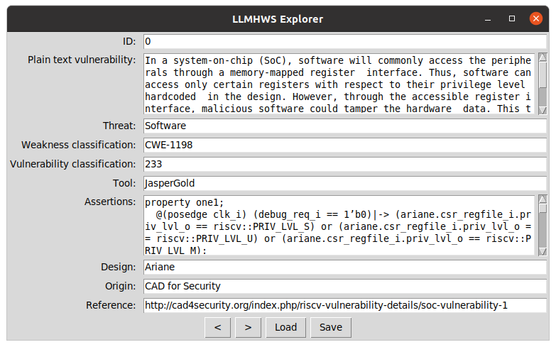

# LLM Hardware Security Benchmarking Dataset

*Pre-Alpha Version*. All the contents are subject to change. 

## Introduction

This repository is meant to host a dataset of potential hardware vulnerabilites that includes "enough information to enable benchmarking of large language models." The exact meaning of this phrase is up for discussion. This is what we know or have decided on so far: 
 - The source data is maintained in YAML. It's human-readable and machine-parsable, and it can be conveniently version controlled via Git.
 - The resources to be used include (but are not limited to) Trust Hub, CAD4Assurance, CWE.
 - A complete record will include an English description of the vulnerability, CWE classification, SystemVerilog assertions, and the original source code for which the assertions have been written or a link to it, and licensing information.
 - Open source data is preferred to simplify sharing and contribution. If relevant high-quality data of a non-open nature becomes available, we will decide on how to deal with it.

# News
A simple GUI has been added to simplify browsing the dataset and adding records. It can be executed via: 

`python tools/dbgui.py source.yaml`

# Understanding `source.yaml`

## Keys
 - ID (integer, autoincrement): Unique record ID
 - Plain: Plain (English) language description of the vulnerability. Can be multiline.
 - Threat: Threat model.
   - Software: Hardware vulnerabilities that can be exploited by malicious software code. Relevant in the context of SoC security. 
- WeaknessClassification (List of string): The classification of the weakness (e.g. "CWE-###", "Hardware Trojan", etc.)
- CAPEC (list of integers): CAPEC number if applicable
- Assertions: SystemVerilog assertions written to check for the vulnerability. Can be multiline.
- Design: Path to the design file (Deprecated: Name of the design involved)
  - Ariane: https://github.com/lowRISC/ariane
- Origin: Dataset of origin, or the source website.
  - CAD for Security: http://cad4security.org
- Reference: URL of the reference.

## Severity Classification
A vulnerability might be "strategy-level", "decision-level" or "typo-level". 
 - A strategy-level vulnerability is a result of strategic, high-level mistakes and needs fundamental changes to the approach to be fixed, including the design specification. Example: "This database should have been encrypted."
 - A decision-level vulnerability is caused by mistaken design decisions within a team or subdivision, and can be addressed by the same people. Documentation may need minor revisions to reflect the new design decisions. Example: "There must be some access control between this module and the primary data bus."
 - A typo-level vulnerability is the result of a mistake or a miscalculation by a single developer and can be fixed by the developer themself when noticed. There is probably no need to update the specification and documentation beyond the comments in the affected files. Example: "This signal should be buffered."

# Contributors' Guide
Use YAML: https://learnxinyminutes.com/docs/yaml/

All data must be stored in `source.yaml`. Other artifacts are automatically generated from the source. 

Please follow the guidelines in `ContributionRules.md`. Include the original design code in `Designs` folder if possible. The expected format is to use a sensible folder name that includes some script file meant to simulate or verify the design. 

**Please be mindful of the relevant licenses when using or referencing to this repository, specially the 'Designs' folder that contains external code with minor modifications.**

# TODO

## Conceptual
 - Come up with a proper schema for sharing the data
 - Draft a contribution guide to inform uniformity
 - Decide on best practices in case of missing datapoints - how to avoid holes? How zealous should we be?
 - Decide on licensing and attribution

## Technical
 - Add GitHub actions to auto-generate the artifacts in other useful formats (probably JSON and SQLDB would suffice for now)

# Who are we?
Placeholder - the exact roles of the contributers are TBD
